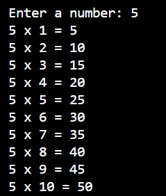

# Multiplication Table Program

This program generates the multiplication table for any number entered by the user, from 1 to 10.

## How it Works:
1. The Program prompts the user to input a number.
2. It then calculates and display the multilpication table for that number, showing result from 1x to 10x.

## Usage:
- Run the program.
- Enter any integer when prompted.
- The program will print the multiplication table for the entered number.

### Example:
### Step1:
```
gcc -o main main.c
```

### Step2:
```
.\main.exe
```
### Output:


### Requirements:
- C compiler (like GCC or Turbo C).
